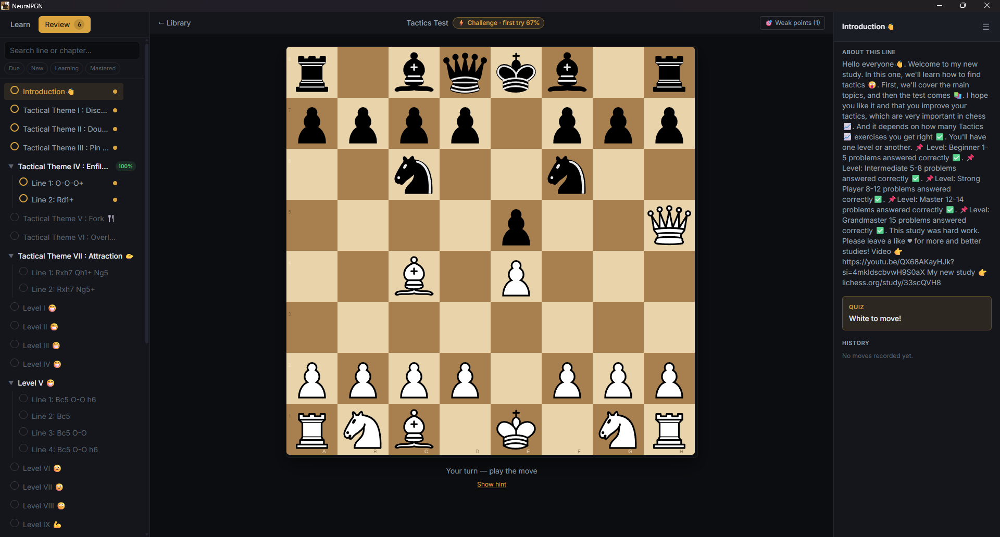

<p align="center">
  
</p>

<h1 align="center">NeuralPGN</h1>

<p align="center">
  A local-first chess repertoire trainer with real spaced repetition.<br />
  Import your PGNs or Lichess studies, drill them line by line, and let FSRS decide when you review.
</p>

<p align="center">
  <a href="https://github.com/kfunezc204/neuralpgn/releases/latest"></a>
  
  <a href="LICENSE"></a>
</p>

<p align="center">
  
</p>

## Why NeuralPGN?

Most opening trainers are web services: your repertoire lives on someone else's server, behind an account, often behind a subscription. NeuralPGN takes the opposite approach:

- **Your files, your machine.** Everything is stored in a local SQLite database. No account, no subscription, works offline.
- **FSRS scheduling.** Reviews are scheduled with [FSRS](https://github.com/open-spaced-repetition/ts-fsrs), the modern spaced-repetition algorithm used by Anki — not a naive "every N days" rule. You review a line exactly when you're about to forget it.
- **Lichess studies as your content source.** Build your repertoire in a Lichess study, paste the link, and train it here.

## Features

- **PGN import** — drag & drop any PGN file; games with variations are split into individual trainable lines.
- **Lichess study import** — import a study (or a single chapter) directly from its URL.
- **Learn / Review workflow** — new lines are _taught_ first (moves shown with comments and board arrows from the PGN), then _quizzed_ from memory. Failed moves show the refutation and its continuation.
- **FSRS spaced repetition** — each line is graded on how you performed (clean pass / pass with retries / fail) and rescheduled accordingly.
- **Review All** — one session that walks every due line across your whole library.
- **Challenge courses** — tactics-style packs where the first attempt _is_ the exercise: new lines quiz you blind instead of teaching first.
- **Weak points** — moves you keep missing are collected into a dedicated drill deck.
- **Game Check** — sync your latest Lichess games (or import a PGN of your own games) and see exactly where you left your repertoire; drill each deviation or dismiss it.
- **Daily limits** — cap how many new lines enter rotation per day so the review queue stays sane.
- **Profiles** — separate repertoires, stats, and schedules per player.
- **Backups & recovery** — one-click backup and atomic restore of your entire database.
- **Auto-updates** — signed updates delivered straight from GitHub Releases.
- **Keyboard-first** — shortcuts for everything; press `?` in-app to see the overlay.

## Install

Grab the installer for the [latest release](https://github.com/kfunezc204/neuralpgn/releases/latest).

> **Windows SmartScreen note:** the binaries are not signed with a paid code-signing certificate, so Windows may show a "protected your PC" warning on first run. Click _More info → Run anyway_. Updates themselves are cryptographically signed and verified by the app before installing.

The app talks to the network for exactly two things: `lichess.org` when you import a study or sync your games for Game Check, and GitHub Releases when checking for updates. Everything else is local.

## How training works

1. **Import** a PGN or Lichess study. Each variation becomes a _line_.
2. **Learn** — the app plays through a new line with you, showing comments and arrows from the source PGN.
3. **Review** — when a line comes due, you play your side's moves from memory. Wrong move? You get a retry, then the correct move with its refutation continuation.
4. **Repeat** — your result (perfect / with retries / failed) feeds FSRS, which schedules the next review: hard lines come back in hours, mastered lines in months.

## Game Check: train against your real games

Knowing your repertoire in the trainer is one thing — playing it under the clock is another. Game Check closes that loop:

1. **Bring in your games.** Set your player name once, then click _Sync Lichess_ to download your latest games (standard chess only, all time controls), or import any PGN of your own games — Chess.com exports work too. Games are deduplicated, so re-syncing and re-importing are always safe.
2. **See where you left book.** Each game is compared against your repertoire by position, so transpositions are handled correctly. Every move where you had a repertoire answer but played something else shows up as a _deviation_: what you played, what your repertoire expects, and which course the line comes from.
3. **Act on each deviation.** Open it on the board — the expected move is drawn as an arrow, and you can replay the whole game with clickable notation (deviations marked in red). Then either **Drill** it (the position joins your weak-point deck, weighted like a repeated miss) or **Dismiss** it (it was blitz, it was deliberate — it never comes back).
4. **Browse your archive.** Every imported game is kept in a searchable Games tab with its deviation count, so you can revisit any game later or clean up old imports.

Deviations are never frozen: they're recomputed against your _current_ repertoire every time you open the view, so adding or removing a course updates your pending list automatically. Verdicts stick — a deviation you've drilled or dismissed stays resolved even if you re-import the same games.

## Development

Prerequisites: [Node.js](https://nodejs.org/) ≥ 20, [Rust](https://rustup.rs/), and the [Tauri 2 prerequisites](https://tauri.app/start/prerequisites/) for your platform.

```sh
npm install
npm run tauri dev     # run the desktop app in dev mode
```

Other useful commands:

```sh
npm test              # unit tests (Vitest)
npm run typecheck     # TypeScript
npm run lint          # ESLint
npm run tauri build   # production bundle + installers
```

Releases are cut by pushing a `v*` tag; CI builds, signs, and publishes the updater artifacts.

### Tech stack

React 19 + TypeScript + Tailwind CSS 4 on the frontend, [chessground](https://github.com/lichess-org/chessground) for the board, [chess.js](https://github.com/jhlywa/chess.js) for rules, [ts-fsrs](https://github.com/open-spaced-repetition/ts-fsrs) for scheduling, and Tauri 2 with SQLite for the shell and storage. The domain logic lives in `src/lib/` behind filesystem/SQL adapter interfaces, with in-memory implementations backing the test suite.

## Contributing

Issues and PRs are welcome. If you're reporting a training bug, attaching the offending PGN (or a link to the Lichess study) makes it much easier to reproduce.

## Support

NeuralPGN is free and open source, built in my spare time. If it's part of your training routine and you want to support development, you can [buy me a coffee on Ko-fi](https://ko-fi.com/kfunezc204) ☕ — entirely optional, the app will always be free.

## License

[MIT](LICENSE)
